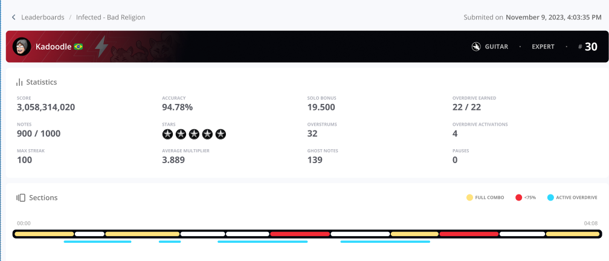
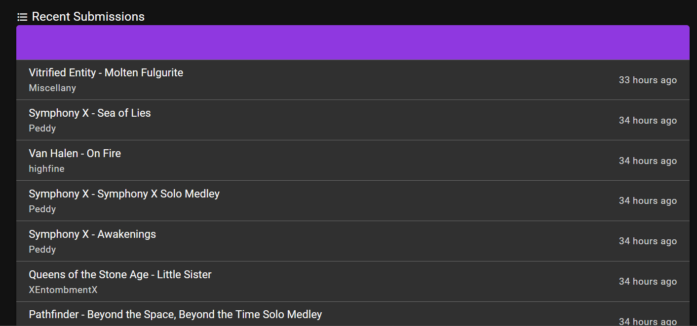

# Gaming Leaderboard Demo  - Next.js + ScyllaDB application
This repository contains a sample gaming leaderboard application built with [Blitz.js](https://blitzjs.com/), [Material-UI](https://mui.com/material-ui/) and [ScyllaDB](https://www.scylladb.com/).

## Prerequisites
* [NodeJS](https://nodejs.org/en)
* [ScyllaDB Cloud account](https://cloud.scylladb.com/account/sign-up)

## Get started

**Clone the repository**
```
git clone https://github.com/danielhe4rt/leaderboard-demo
```

### Configuration file

Create a new configuration file named `.env.local` in the project's root folder. This file contains your ScyllaDB cluster credentials:
```
# .env.local
APP_BASE_URL="http://localhost:8000"
SCYLLA_HOSTS="node-0.aws_eu_central_1.xxxxx.clusters.scylla.cloud"
SCYLLA_USER="scylla"
SCYLLA_PASSWD="xxxxx"
SCYLLA_KEYSPACE="streaming"
SCYLLA_DATACENTER="AWS_EU_CENTRAL_1"
```

You can copy the `SCYLLA_HOSTS`, `SCYLLA_USER`, `SCYLLA_PASSWD` and `SCYLLA_DATACENTER` values from your ScyllaDB Cloud dashboard. Keyspace should be `streaming`.

### Install project requirements
```
npm install
```

### Default Keyspace config.

```sql
-- Keyspace Config
CREATE KEYSPACE IF NOT EXISTS leaderboard WITH replication = { 'class': 'NetworkTopologyStrategy', 'replication_factor': '3' };
```

### Features

Here's a detailed list of feature from the game leaderboard example. 

### Game Tracks 


List all tracks played so far with scoreboard. 

* GET - /tracks

```sql
-- Data Model
CREATE TABLE IF NOT EXISTS leaderboard.tracks(
	track_id text,
	title text,
	artist text,
	album text,
	cover_url text,
	duration int,
	PRIMARY KEY (track_id)
);

INSERT INTO leaderboard.tracks (track_id, title, artist, album, cover_url, duration) VALUES ('kashmir', 'Kashmir', 'Led Zeppelin', 'Mothership', 'https://i.scdn.co/image/ab67616d0000b27322f1b6c28ce5735646b2e569', 517);
INSERT INTO leaderboard.tracks (track_id, title, artist, album, cover_url, duration) VALUES ('high-hopes', 'High Hopes',  'Panic! At the Disco', 'Pray for the Wicked','https://i.scdn.co/image/ab67616d0000b273c5148520a59be191eea16989', 517);

SELECT * FROM tracks LIMIT 9;
SELECT * FROM tracks WHERE track_id = 'kashmir';
```

#### Game Submission


Page with information regarding of that specific submissions from a played game. 

* GET - /submissions/{submissionId}
* POST - /submissions

> For this specific query I'll not use the **played_at** clustering, however in the next feature that involves Materialized View, I opted to let it here. 

```sql
-- Data Modeling 
CREATE TABLE IF NOT EXISTS leaderboard.submissions (
	submission_id uuid,
	song_id text,
	user_id text,
	modifiers frozen<set<text>>,
	score int,
	difficulty text,
	instrument text,
	stars int,
	accuracy_percentage float,
	missed_count int,
	ghost_notes_count int,
	max_combo_count int,
	overdrive_count int,
	speed int,
	played_at timestamp,
	PRIMARY KEY (submission_id, played_at)
);

-- Queries

INSERT INTO leaderboard.submissions (submission_id, user_id, played_at) VALUES (ce772595-7b3b-48d8-b993-d323d1149165, 'danielhe4rt', '2019-01-01 00:00:00+0000');

SELECT * FROM leaderboard.submissions WHERE submission_id = ce772595-7b3b-48d8-b993-d323d1149165;
```

#### User Games History



Materialized view from *submissions* to fetch the games history ordered latest submissions.

* GET - /user/{userId}/last-submissions

```sql
-- Data Modeling
CREATE MATERIALIZED VIEW leaderboard.user_submissions AS
    SELECT *
    	FROM leaderboard.submissions
    	WHERE 
			submission_id IS NOT null AND
			user_id IS NOT null AND
			played_at IS NOT null
    	PRIMARY KEY (user_id, played_at, submission_id)
    WITH CLUSTERING ORDER BY (played_at DESC);

-- Queries
INSERT INTO leaderboard.submissions (submission_id, user_id, played_at) VALUES (ce772595-7b3b-48d8-b993-d323d1149165, 'danielhe4rt', '2019-01-01 00:00:00+0000');
INSERT INTO leaderboard.submissions (submission_id, user_id, played_at) VALUES (2ebc2ae5-742c-405f-978a-0ffc33fc9d6e, 'danielhe4rt', '2019-01-03 00:00:00+0000');
INSERT INTO leaderboard.submissions (submission_id, user_id, played_at) VALUES (0df45aee-837a-433e-b4cc-506a1e1c367a, 'danielhe4rt', '2019-01-02 00:00:00+0000');

SELECT user_id, played_at FROM leaderboard.user_submissions WHERE user_id = 'danielhe4rt' LIMIT 3;

-- submission_id                        | played_at
----------------------------------------+----------------------------------
-- 2ebc2ae5-742c-405f-978a-0ffc33fc9d6e | 2019-01-03 00:00:00.000000+0000
-- 0df45aee-837a-433e-b4cc-506a1e1c367a | 2019-01-02 00:00:00.000000+0000
-- ce772595-7b3b-48d8-b993-d323d1149165 | 2019-01-01 00:00:00.000000+0000
----------------------------------------+----------------------------------
```

#### Song Leaderboard


List top submissions in a specific song by **descending score**.

* GET - /leaderboard/{song_id}

```sql
-- Data Model
CREATE TABLE IF NOT EXISTS leaderboard.song_leaderboard (
	submission_id uuid,
	song_id text,
	user_id text,
	modifiers frozen<set<text>>,
	score int,
	difficulty text,
	instrument text,
	stars int,
	accuracy_percentage float,
	missed_count int,
	ghost_notes_count int,
	max_combo_count int,
	overdrive_count int,
	speed int,
	played_at timestamp,
	PRIMARY KEY ((song_id, modifiers, difficulty, instrument), score)
) WITH CLUSTERING ORDER BY (score DESC);

-- Queries

INSERT INTO leaderboard.song_leaderboard (song_id, user_id, score, modifiers, difficulty, instrument, played_at) VALUES ('fade-to-black', 'danielhe4rt', 10000, {'none'}, 'expert', 'guitar' ,'2019-01-01 00:00:00+0000');
INSERT INTO leaderboard.song_leaderboard (song_id, user_id, score, modifiers, difficulty, instrument, played_at) VALUES ('fade-to-black', 'tzach', 12000, {'none'}, 'expert', 'guitar' ,'2019-01-01 00:00:00+0000');
INSERT INTO leaderboard.song_leaderboard (song_id, user_id, score, modifiers, difficulty, instrument, played_at) VALUES ('fade-to-black', 'kadoodle', 9999, {'none'}, 'expert', 'guitar' ,'2019-01-02 00:00:00+0000');

SELECT 
	user_id, score 
FROM 
	leaderboard.song_leaderboard 
WHERE 
	instrument = 'guitar' AND
	difficulty = 'expert' AND
	modifiers = {'none'} AND
	song_id = 'fade-to-black' 
LIMIT 
	100;

--     user_id  | score
----------------+-------
--        tzach | 12000
--  danielhe4rt | 10000
--     kadoodle |  9999
----------------+-------
```


## Running the App

```
npm run dev
> video-streaming@1.0.0 dev
> blitz dev

✔ Next.js was successfully patched with a React Suspense fix
✔ Routes manifest was successfully generated
- ready started server on 0.0.0.0:3000, url: http://localhost:3000
```

Go to http://localhost:3000 to open the app.


